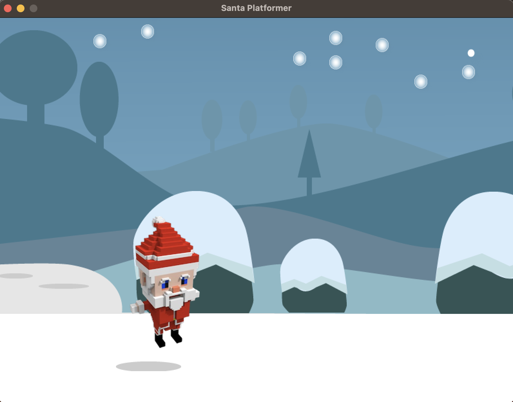

# **Santa Platformer Game**

A Lua-based platformer game featuring Santa, built with LOVE2D. The game showcases Santa navigating platforms with smooth physics and festive visuals, perfect for spreading holiday cheer.


---

## **Features**

- **Play as Santa**: Control Santa as he runs, jumps, and explores a platforming world.
- **Smooth Gameplay**: Includes gravity and collision mechanics for realistic movement.
- **Festive Graphics**: Enjoy a cheerful background, snowy platforms, and a lively Santa character.

---

## **Technologies Used**

- **Lua**: Lightweight and efficient programming language.
- **LOVE2D**: Framework for 2D game development, providing robust tools for graphics, physics, and input handling.

---

## **Setup Instructions**

### **Clone or Download the Repository**

Download the project files or clone the repository:

```bash
git clone https://github.com/rusuraluca/advent-2024
cd day14
```

### **Run the Application**

### **Using VS Code Dev Containers**

- Open the project in Visual Studio Code.
- Reopen the project in the Dev Container:
  - Open the Command Palette (Ctrl+Shift+P or Cmd+Shift+P) and select Dev Containers: Reopen in Container.
- Open a terminal inside the container and run:

    ```bash
    love .
    ```
