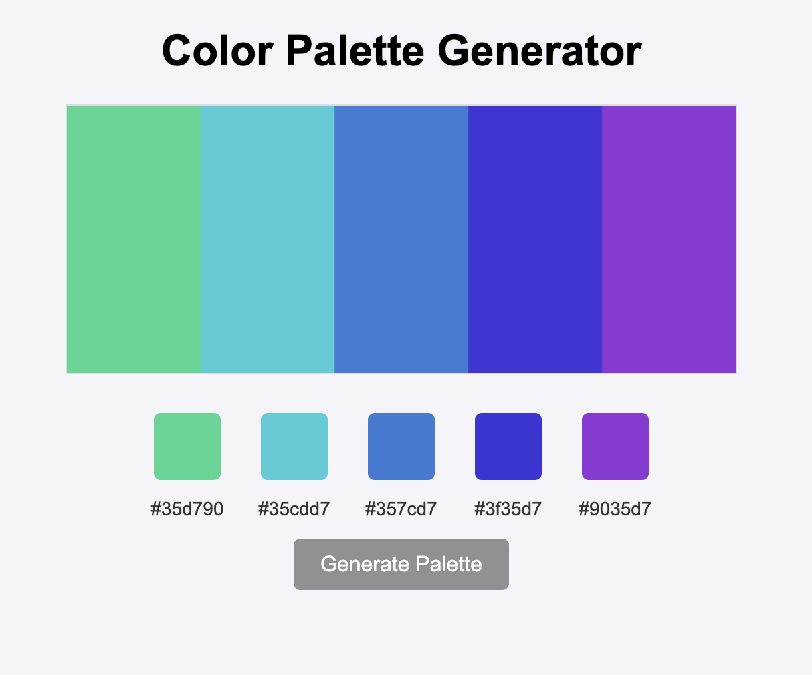

# **Color Palette Generator**

A simple web application that generates harmonious color schemes using JavaScript's Canvas API. The app creates a palette of colors and displays their hex codes below the canvas.


---

## **Features**
- **Color Palette Generation:** Click a button to generate a set of harmonious colors based on a random base color.
- **Color Display:** View the colors visually on the canvas.
- **Hex Code Display:** See the hex codes of each color displayed below the palette.

---

## **Technologies Used**
- **HTML5**: For the structure of the web page.
- **CSS3**: For styling the UI and layout.
- **JavaScript**: For generating random colors and drawing the palette using the Canvas API.
- **Canvas API**: Used to dynamically draw the color palette.
- **DOM Manipulation**: Used for displaying the color codes below the canvas.

---

## **Setup Instructions**

### **Prerequisites**
- A modern web browser (Google Chrome, Firefox, etc.).

### **Clone the Repository**
```bash
git clone https://github.com/rusuraluca/advent-2024
cd day2
```

### **Run the Application**
Open the index.html file in your browser or start a local server.