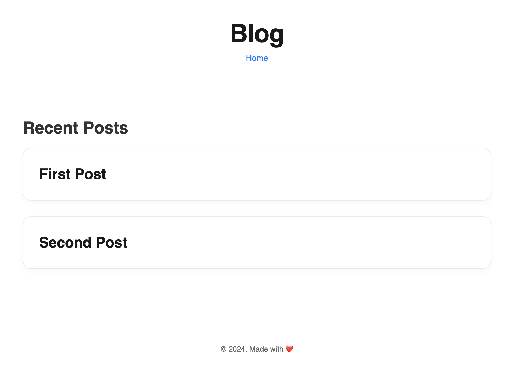

# **Ruby Static Website Generator**

A lightweight Ruby-based static website generator that converts Markdown files into a clean, visually appealing blog. This generator uses ERB templates for rendering HTML.


---

## **Features**

- **Markdown to HTML Conversion:** Easily create blog posts by writing in Markdown format.
- **Template-Based Rendering:** Use customizable ERB templates for dynamic content rendering.
- **Auto-Generated Index:** A home page listing all blog posts with clickable links.
- **Responsive Design:** Ensures usability across devices.

---

## **Technologies Used**

- **Ruby 3.0+**
- **ERB (Embedded Ruby):** For dynamic HTML template rendering.
- **HTML/CSS:** To style the output for a seamless reading experience.
- **Markdown:** Content format for blog posts.

---

## **Setup Instructions**

### **Prerequisites**

- Ruby 3.0 or higher installed on your system.
- Bundler for managing Ruby gems (optional but recommended).

### **Clone the Repository**

```bash
git clone https://github.com/rusuraluca/advent-2024
cd day3
```

### **Install Dependencies**

Ensure required Ruby gems are installed:

```bash
bundle install
```

### **Add Your Markdown Blog Posts**

- Place Markdown files (.md) in the posts/ directory.
- Each file must start with a # title on the first line to be correctly indexed.

e.g.

```md
# My First Blog Post

This is the content of my first blog post.
```

### **Generate the Static Website**

Run the generator script:

```bash
ruby generate.rb
```

### **Preview Your Site**

Serve the public/ directory locally to preview your blog:

```bash
ruby -run -e httpd public/ -p 8000
```

Open your browser and navigate to <http://localhost:8000/>.
