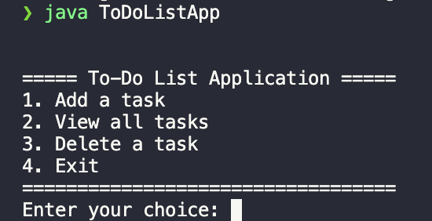

# **To-Do List**

A Java-based console application for managing a to-do list. This app allows users to add, view, and delete tasks directly from the command line in an intuitive way.


---

## **Features**
- **Add Tasks**: Quickly add tasks with simple text input.
- **View Tasks**: See a list of all your current tasks in order.
- **Delete Tasks**: Remove completed or unnecessary tasks by selecting them from the list.
- **Exit**: Cleanly exit the application while keeping your task progress in memory during the session.

---

## **Technologies Used**
- **Java**: Core programming language for the application.
- **ArrayList**: Used to manage the dynamic list of tasks.
- **Scanner**: Handles user input from the console.

---

## **Setup Instructions**

### **Prerequisites**
- Java Development Kit (JDK) installed (version 8 or higher recommended).
- A code editor or IDE (e.g., Visual Studio Code, IntelliJ IDEA, Eclipse).

### **Clone or Download the Repository**
Download the project files or clone the repository:
```bash
git clone https://github.com/rusuraluca/advent-2024
cd day7
```

### **Compile and Run the Application**
Run the following commands:
```bash
javac ToDoListApp.java
java ToDoListApp
```