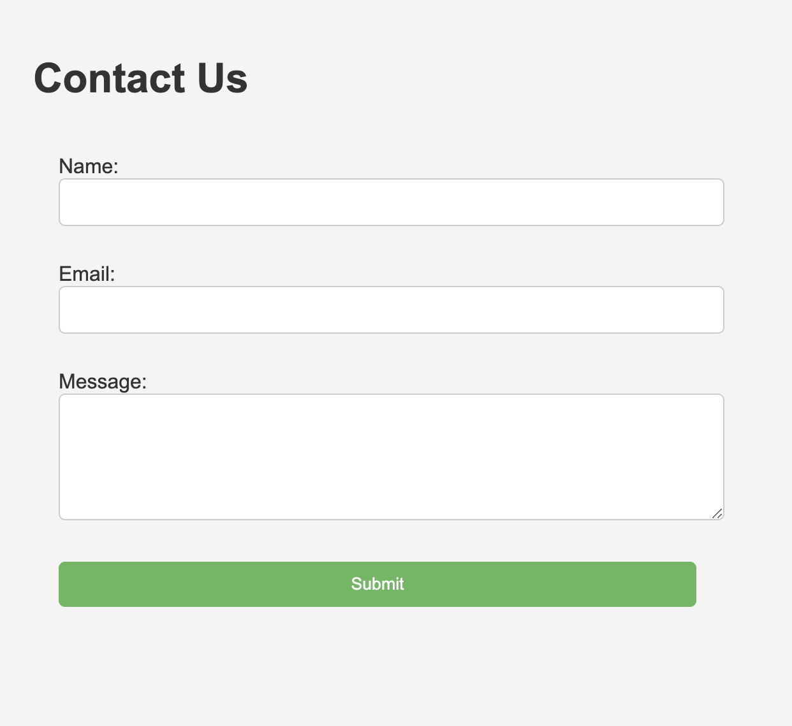

# **Contact Form**

A PHP-based web application for submitting and storing contact form entries. This simple app allows users to send messages via a form, which are then saved to a file for easy access and management.


---

## **Features**
- **Submit Messages**: Users can fill out their name, email, and a message in the form.
- **Store Submissions**: All submitted entries are saved in a local file (submissions.txt) for future reference.
- **Instant Feedback**: Confirmation message displayed upon successful submission.

---

## **Technologies Used**
- **PHP**: Core server-side programming language.
- **HTML/CSS**: Used for creating and styling the contact form.
- **File Handling**: PHP’s file_put_contents for saving data securely.

---

## **Setup Instructions**

### **Prerequisites**
- PHP installed on your system (version 7.4 or higher recommended).
- A text editor or IDE (e.g., Visual Studio Code, Sublime Text, PhpStorm).

### **Clone or Download the Repository**
Download the project files or clone the repository:
```bash
git clone https://github.com/rusuraluca/advent-2024
cd day8
```

### **Compile and Run the Application**
Run the following command:
```bash
php -S localhost:8000
```

Open the following URL in your browser: `http://localhost:8000/index.php`